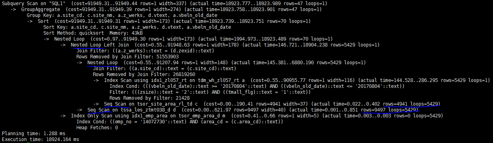
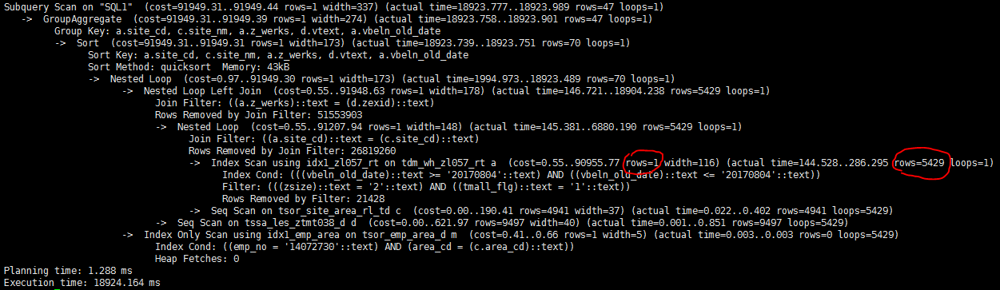
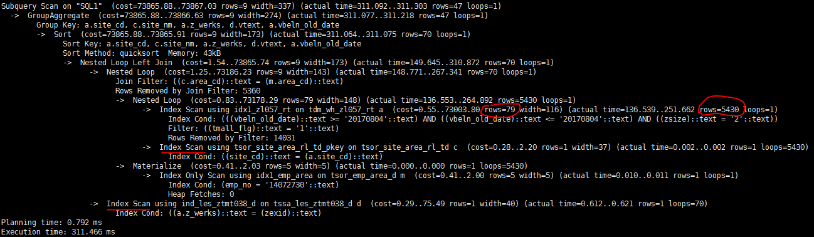

# 一次PostgreSQL行估算偏差导致的慢查询分析

## 问题

最近某业务系统上线了新功能，然后我们就发现PostgreSQL日志中多了很多慢查询。这些SQL语句都比较相似，下面是其中一个SQL的`explain analyze`执行计划输出。

这个SQL执行了18秒，从上面的执行计划不难看出，时间主要耗在两次嵌套join时对子表的顺序扫描(图中蓝线部分)。乘以5429的循环次数，每个join都要顺序扫描2000多万条记录。

## 分析

既然是顺序扫描惹的祸，那么在join列上加个索引是不是就可以了呢？

但是查看相关表定义后，发现在相关的表上已经有索引了；而且即使没有索引，PG也应该可以通过Hash join回避大量的顺序扫描。

再仔细看下执行计划里的cost估算，发现PG估算出的rows只有1行，而实际是5429(图中红线部分)。看来是行数估算的巨大偏差导致PG选错了执行计划。

### 为什么估算行数偏差这么大？

通过尝试，发现问题出在下面的过滤条件上。不加这个过滤条件估算行数和实际行数是基本吻合的，一加就相差的离谱。

	Filter: (((zsize)::text = '2'::text) AND ((tmall_flg)::text = '1'::text))

而上面的`zsite`的数据类型是`char(10)`,`tmall_flg`的数据类型是`int`，难道是类型转换惹的祸？
在测试环境把尝试去掉SQL里的类型转换，发现执行时间立刻从10几秒降到1秒以内。看来原因就是它了。

	zsize::text = '2' AND tmall_flg::text = '1'

==》

	zsize = '2' AND tmall_flg = 1

生产环境下，因为修改应用的SQL需要时间，临时采用下面的回避措施

	alter table bi_dm.tdm_wh_zl057_rt alter zsize type varchar(10);

即把zsize的类型从`char(10)`改成`varchar(10)`(varchar到text的类型转换不会影响结果行估算)。由于没有改`tmall_flg`,修改之后，估算的行数是79行，依然不准确。但是这带来的cost计算值的变化已经足以让PG选择索引扫描而不是顺序扫描了。修改之后的执行时间只有311毫秒。

## 原理

### PG如何估算结果行数

PG通过收集的统计信息估算结果行数，并且收集的统计信息也很全面，包括唯一值数量，频繁值分布，柱状图和相关性，正常情况下应该是比较准确的。看下面的例子

- 无where条件

		postgres=# explain select * from bi_dm.tdm_wh_zl057_rt;
		                                QUERY PLAN                                 
		---------------------------------------------------------------------------
		 Seq Scan on tdm_wh_zl057_rt  (cost=0.00..81318.21 rows=2026121 width=154)
		(1 row)

	全表数据的估算值来自`pg_class`

		postgres=# select reltuples from pg_class where relname='tdm_wh_zl057_rt';
		 reltuples 
		-----------
		   2026121
		(1 row)

	估算值和实际值的误差只有5%左右

		postgres=# select count(*) from bi_dm.tdm_wh_zl057_rt;
		  count  
		---------
		 2103966
		(1 row)

- 带等值where条件

		postgres=# explain select * from bi_dm.tdm_wh_zl057_rt where tmall_flg = 1;
		                                QUERY PLAN                                
		--------------------------------------------------------------------------
		 Seq Scan on tdm_wh_zl057_rt  (cost=0.00..86403.32 rows=523129 width=154)
		   Filter: (tmall_flg = 1)
		(2 rows)

	带where条件后，PG根据`pg_stats`收集的列值分布信息估算出where条件的选择率。
    `tmall_flg = 1`属于频繁值，`most_common_freqs`中直接记录了其选择率为0.258133322

		postgres=# select * from pg_stats where tablename='tdm_wh_zl057_rt' and attname='tmall_flg';
		-[ RECORD 1 ]----------+--------------------------------------
		schemaname             | bi_dm
		tablename              | tdm_wh_zl057_rt
		attname                | tmall_flg
		inherited              | f
		null_frac              | 0.00033333333
		avg_width              | 4
		n_distinct             | 5
		most_common_vals       | {0,1,2}
		most_common_freqs      | {0.626866639,0.258133322,0.114566669}
		histogram_bounds       | {3,4}
		correlation            | 0.491312951
		most_common_elems      | 
		most_common_elem_freqs | 
		elem_count_histogram   |

	结合总记录数，可以算出估算结果行数。

		postgres=# select 2026121*0.258133322;
		     ?column?     
		------------------
		 523009.344503962
		(1 row)

	估算值和实际值的误差只有1%左右

		postgres=# select count(*) from bi_dm.tdm_wh_zl057_rt where tmall_flg = 1;
		 count  
		--------
		 532630
		(1 row)

- 带等值where条件，且条件列带类型转换
	
		postgres=# explain select * from bi_dm.tdm_wh_zl057_rt where tmall_flg::text = '1';
		                               QUERY PLAN                                
		-------------------------------------------------------------------------
		 Seq Scan on tdm_wh_zl057_rt  (cost=0.00..96561.46 rows=10131 width=155)
		   Filter: ((tmall_flg)::text = '1'::text)
		(2 rows)

	一旦在条件列上引入包括类型转换，函数调用之类的计算，PG就无法通过`pg_stats`计算选择率了，于是笼统的采用了一个0.005的默认值。通过这个默认的选择率计算的结果行数可能会和实际结果行数有巨大的偏差。如果where条件中这样的列不止一个，偏差会被进一步放大。

		postgres=# select 2026121*0.005;
		 ?column?  
		-----------
		 10130.605
		(1 row)

## 相关代码

src/include/utils/selfuncs.h:

	/* default selectivity estimate for equalities such as "A = b" */
	#define DEFAULT_EQ_SEL	0.005

src/backend/utils/adt/selfuncs.c:

	Datum
	eqsel(PG_FUNCTION_ARGS)
	{
	...
	
		/*
		 * If expression is not variable = something or something = variable, then
		 * punt and return a default estimate.
		 */
		if (!get_restriction_variable(root, args, varRelid,
									  &vardata, &other, &varonleft))
			PG_RETURN_FLOAT8(DEFAULT_EQ_SEL);

## 总结

**在条件列上引入计算带来的危害**:

1. 该列无法使用索引(除非专门定义与查询SQL匹配的表达式索引)   
2. 无法准确评估where条件匹配的结果行数，可能会引发连锁反应进而生成糟糕的执行计划

**回避方法**:

1. 规范表的数据类型定义，避免不必要的类型转换
2. 将计算从列转移到常量上

	比如:  

		where c1 + 1 = 1000

	改成

		where c1 = 1000 - 1

3. 改成其它等价的写法

	比如:

		where substring(c2,2) = 'ZC'

	改成

		where c2 >= 'ZC' and c2 < 'ZD'

	也可以改成更简洁的正则表达式

		where c2 ~ '^ZC'

   但是，正则表达式中如果带了类似`^$*`这样的内容，行数估算准确性也受一定的影响
