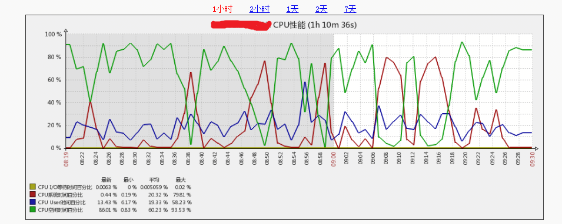

## 现象

生产上citus集群中的一台worker 243上，偶尔会出现sys CPU利用率异常飙高,导致CPU跑满。而当时SQL查询量和user CPU使用率均无特别变化。并且其它3台worker都没有问题。

## 环境

- OS：CentOS release 6.5 x64物理机(2.6.32-431.el6.x86_64)
- CPU: 2*8core 16核32线程， Intel(R) Xeon(R) CPU E5-2630 v3 @ 2.40GHz
- PostgreSQL: 9.6.2

## 原因

对比4台worker的内核参数配置，发现这台worker上的`vm.zone_reclaim_mode`值和其它3台不一致。

	vm.zone_reclaim_mode = 0

其它3台worker的`vm.zone_reclaim_mode`值都是1

## 处理

将这台机器的`vm.zone_reclaim_mode`改为1，运行数天后，该问题未再发生。

## 这台机器的zone配置

	[root@host243 ~]# numactl --show
	policy: default
	preferred node: current
	physcpubind: 0 1 2 3 4 5 6 7 8 9 10 11 12 13 14 15 16 17 18 19 20 21 22 23 24 25 26 27 28 29 30 31 
	cpubind: 0 1 
	nodebind: 0 1 
	membind: 0 1
	
	[root@host243 ~]# cat /proc/meminfo 
	MemTotal:       132035016 kB
	MemFree:        24289928 kB
	Buffers:          125080 kB
	Cached:         67212576 kB
	SwapCached:            0 kB
	Active:         69108484 kB
	Inactive:        2139784 kB
	Active(anon):    3456384 kB
	Inactive(anon):   523868 kB
	Active(file):   65652100 kB
	Inactive(file):  1615916 kB
	Unevictable:           0 kB
	Mlocked:               0 kB
	SwapTotal:      10485752 kB
	SwapFree:       10485752 kB
	Dirty:            764440 kB
	Writeback:             0 kB
	AnonPages:       3980292 kB
	Mapped:            38408 kB
	Shmem:              2156 kB
	Slab:             940480 kB
	SReclaimable:     850140 kB
	SUnreclaim:        90340 kB
	KernelStack:        6088 kB
	PageTables:        58240 kB
	NFS_Unstable:          0 kB
	Bounce:                0 kB
	WritebackTmp:          0 kB
	CommitLimit:    59172060 kB
	Committed_AS:    4845456 kB
	VmallocTotal:   34359738367 kB
	VmallocUsed:      483204 kB
	VmallocChunk:   34289724028 kB
	HardwareCorrupted:     0 kB
	AnonHugePages:   2639872 kB
	HugePages_Total:   16925
	HugePages_Free:      148
	HugePages_Rsvd:       53
	HugePages_Surp:        0
	Hugepagesize:       2048 kB
	DirectMap4k:        5868 kB
	DirectMap2M:     1968128 kB
	DirectMap1G:    132120576 kB

## 疑问

通常建议设置`vm.zone_reclaim_mode = 0`，为什么这里行不通？