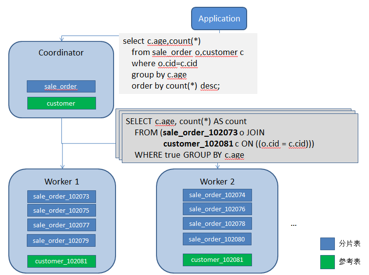

# citus实战系列之入门篇

## citus为何物？

citus是一款基于PostgreSQL的开源分布式数据库,自动继承了PostgreSQL强大的SQL支持能力和应用生态（不仅仅是客户端协议的兼容还包括服务端扩展和管理工具的完全兼容）。
和其他类似的基于PostgreSQL的分布式方案，比如GreenPlum，PostgreSQL-XL，PostgreSQL-XC相比，citus最大的不同在于citus是一个PostgreSQL扩展而不是一个独立的代码分支。
因此，citus可以用很小的代价和更快的速度紧跟PostgreSQL的版本演进；同时又能最大程度的保证数据库的稳定性和兼容性。

### 主要特性

- PostgreSQL兼容
- 水平扩展
- 实时并发查询
- 快速数据加载
- 实时增删改查
- 支持分布式事务
- 支持常用DDL

### 性能参考

为了能够直观的了解citus分片表的性能优势，下面在1个CN和8个worker组成citus集群上，
对比普通表和分片表(96分片)的性能差异。

<table>
    <thead>
           <th>项目</th>
           <th>普通表(ms)</th>
           <th>分片表(ms)</th>
    </thead>
    <tr>
        <td>插入1亿记录(5GB)</td>
        <td>348051</td>
        <td>82131</td>
    </tr>
    <tr>
        <td>count(*)</td>
        <td>348051</td>
        <td>82131</td>
    </tr>
    <tr>
        <td>插入1亿记录(5GB)</td>
        <td>10246(2并发)</td>
        <td>271</td>
    </tr>
    <tr>
        <td>建索引</td>
        <td>165582</td>
        <td>2579</td>
    </tr>
    <tr>
        <td>添加带缺省值的字段</td>
        <td>388481</td>
        <td>10522</td>
    </tr>
    <tr>
        <td>删除5000w记录</td>
        <td>104843</td>
        <td>6106</td>
    </tr>
</table>

相关的表定义和SQL如下

普通表:

	create table tbchj_local(id int primary key,c1 int,c2 text);
	insert into tbchj_local select a*10000+b,random()*10000000::int,'aaaaaaa' from generate_series(1,10000)a,generate_series(1,10000)b;
	select count(*) from tbchj_local;
	create index idx_tbchj_local_c1 on tbchj_local(c1);
	alter table tbchj_local add c3 int default 9;
	delete from tbchj_local where id %2 =0;

分片表

	create table tbchj(id int primary key,c1 int,c2 text);
	set citus.shard_count=96;
	insert into tbchj select a*10000+b,random()*10000000::int,'aaaaaaa' from generate_series(1,10000)a,generate_series(1,10000)b;
	select count(*) from tbchj;
	create index idx_tbchj_c1 on tbchj(c1);
	alter table tbchj add c3 int default 9;
	delete from tbchj where id %2 =0;

## 技术架构

citus集群由一个中心的协调节点(CN)和若干个工作节点(Worker)构成。CN只存储和数据分布相关的元数据，实际的表数据被分成M个分片，打散到N个Worker上。这样的表被叫做“分片表”，可以为“分片表”的每一个分片创建多个副本，实现高可用和负载均衡。citus官方文档更建议使用PostgreSQL原生的流复制做HA，基于多副本的HA也许只适用于append only的分片。

分片表主要解决的是大表的水平扩容问题，对数据量不是特别大又经常需要和分片表Join的维表可以采用一种特殊的分片策略，只分1个片且每个Worker上部署1个副本，这样的表叫做“参考表”。除了分片表和参考表，还剩下一种没有经过分片的PostgreSQL原生的表，被称为“本地表”。“本地表”适用于一些特殊的场景，比如高并发的小表查询。

客户端应用访问数据时只和CN节点交互。CN收到SQL请求后，生成分布式执行计划，并将各个子任务下发到相应的Worker节点，之后收集Worker的结果，经过处理后返回最终结果给客户端。

## 适用场景

citus适合两类业务场景

1. 实时数据分析

	citus不仅支持高速的批量数据加载(20w/s)，还支持单条记录的实时增删改查。
	查询数据时，CN对每一个涉及的分片开一个连接驱动所有相关worker同时工作。并且支持过滤，投影，聚合，join等常见算子的下推，尽可能减少CN的负载。所以，对于count()，sum()这类简单的聚合计算，在128分片时citus可以轻松获得和PostgreSQL单并发相比50倍以上的性能提升。

2. 多租户

	和很多分布式数据库类似，citus对分片表间join的支持存在一定的限制。而多租户场景下每个租户的数据按租户ID分片，业务的SQL也带租户ID。因此这些SQL都可以直接下推到特定的分片上，避免了跨库join和跨库事务。

按现下流行的说法，citus可以算是一个分布式HTAP数据库，只是AP方面SQL的兼容性有待继续提升，TP方面还缺一个官方的多CN支持。

## SQL限制与回避方法

citus对复杂SQL的支持能力还有所欠缺(和GreenPlum相比)，这主要反映在跨库join，子查询和窗口函数上。好在目前citus的开发非常活跃，几乎2个月就出一个新的大版本，并大幅度改善其SQL支持能力。下面罗列了7.3版本的主要SQL限制。

### join

Join是分布式数据库比较头疼的问题。citus处理Join有两种方式，一种是把Join下推到分片上，即本地Join。本地Join，性能最优，但只适用于亲和分片表之间的Join，以及分片表和参考表之间的Join。亲和分片表指的是两个分片规则（分片数，副本数，分片字段，分片位置）完全相同的分片表。定义分片表时，可以在`create_distributed_table()`的参数`colocate_with`中指定和某个已存在的分片表亲和。比如:

	select create_distributed_table('tb2','id',colocate_with=>'tb1');

设计表时应尽可能通过亲和关系以及参考表解决Join的问题。如果无法做到，就只能实施跨库Join。citus支持跨库Join的方式是对数据按Join字段重新分区，这一过程叫做MapMerge。这种方式只支持自然Join，其它Join仍然不支持。

### 子查询

子查询和Join一样存在跨库的问题，有时候子查询可以转化为一个等价的Join，所以和Join有相似的限制。

### 窗口函数

citus只支持PARTITION BY子句包含分片字段的窗口函数。 比如下面的SQL，如果class不是分片字段，这个SQL将不能支持。

	SELECT class, student, course, score, avg(score) 
	   OVER (PARTITION BY class) -- class is not distribution column
	   FROM student_score
       WHERE term = '2017-1';

#### 回避方法

可以通过临时表或dblink将数据拉到CN上处理进行回避。上面的SQL可以改写为

	SELECT class, student, course, score, avg(score) 
	   OVER (PARTITION BY class)
	   FROM dblink('',$$
	     SELECT class, student, course, score FROM student_score WHERE term = '2017-1'
	   $$)
	   as a(class text,student text,course text,score float4);

## 事务一致性

citus中没有全局的事务快照，这和MyCAT等常见的分库分表方案一样。这样可以简化设计提升性能，带来的问题就是不能保证全局的一致性读，而只能实现的最终一致性。

举个例子，从用户A的账户上转账100块到用户B的账户上，用户A和B对应的记录分别位于不同的Worker上。
citus使用2PC处理这个分布式事务，具体处理步骤如下

1. Worker1 : BEGIN;
2. Worker2 : BEGIN;
3. Worker1 : UPDATE account_$shardid SET amount = amount - 100 WHERE user = 'A';
4. Worker2 : UPDATE account_$shardid SET amount = amount + 100 WHERE user = 'B';
5. Worker1 : PREPARE TRANSACTION 'tran1';
6. Worker2 : PREPARE TRANSACTION 'tran2';
7. Worker1 : COMMIT PREPARED 'tran1';
8. Worker2 : COMMIT PREPARED 'tran2';

在步骤7和8之间，参与2PC的2个子事务一个已提交另一个还没提交。 如果此时有人查询账户总额，会得到一个不正确的值。

	SELECT sum(amount) FROM account;

## 部署实施

citus的安装非常简单，但要实际用到生产上还需要下一番功夫。比如如何扩容，这是一个上生产后无法回避的问题，而citus的社区版恰恰又不支持扩容。怎么办? 办法当然是有的，关于citus的部署，后面准备通过一个系列的文章进行介绍，扩容其中一章的内容。

- 入门
- 实验环境搭建
- 平滑扩容
- 多CN部署
- 连接管理
- 高可用

