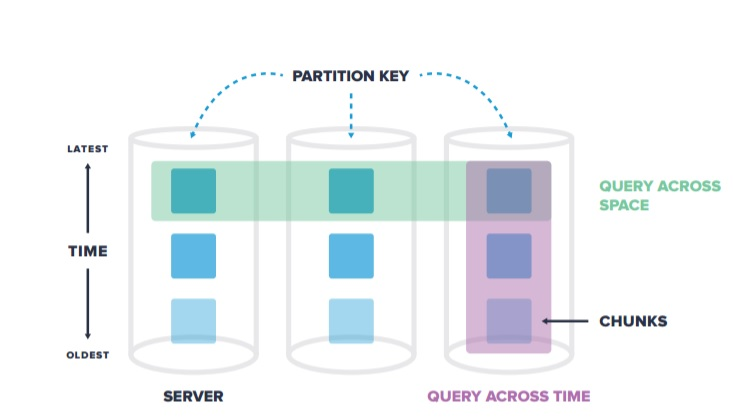

# timesacledb列压缩能否作为冷数据存储方案

## 背景

PostgreSQL不支持块压缩，对数据库中积累的大量访问频度低的冷数据，能否借助第3方插件实现压缩存储呢？

经初步调查，能支持压缩的PG插件都是基于列存储技术，比如下面3个

- VOPS
	函数接口，业务改造太大，不合适
- zedstore
	未GA，不合适
- timescaledb

其中，timescaledb似乎是一个可以考虑的方案。


## 原理

对上面的场景来说，主要需要关注timescaledb的以下功能

### 自动按时间分区

- 指定某个时间类型(date,timestamp,timestamptz)的分区字段，和分区间隔，timescaledb会自动分区。
- 可选的还可以附加额外的分区字段按hash分区，分区数需要定义。
- 每个分区被称为chuck




### 自动对历史分区按列压缩

- 对指定时间以前的分区(chuck)，timescaledb后台worker会自动进行压缩，变成压缩chuck。
- 压缩chuck由一个或多个段(segment)组成，每个段最多存放1000条记录。
- 可以通过`compress_segmentby`参数指定一个或多个分段字段,分段字段值的组合相同的数据属于一个段。
- 可以通过`compress_orderby`参数指定排序字段，对相同分段字段值组合，按排序字段排序后拆分段。
- 段内部字段值（除了分段字段）按排序字段排序后以压缩存放。
- 根据不同的数据类型使用不同的压缩算法，因此压缩率很高。

参考下面的例子。压缩的分段字段为`device_id`，排序字段为`time DESC`。

```
time	device_id	cpu	disk_io	energy_consumption
[12:00:02, 12:00:01]	1	[88.2, 88.6]	[20, 25]	[0.8, 0.85] -- 一个segment,如果超过1000条记录，还会被再拆成多个segment
[12:00:02, 12:00:01]	2	[300.5, 299.1]	[30, 40]	[0.9, 0.95] -- 另一个segment
```

timescaledb会对分段字段自动创建索引，因此对上面的压缩chuck，按`device_id`查询，效率可以保障。


## 演示

对一个有主键的普通表，创建可以压缩的hyper table

```
CREATE TABLE tstb (
 id          bigserial,
 time        TIMESTAMPTZ       NOT NULL,
 pad         TEXT              NOT NULL,
 PRIMARY KEY(id,time)          --主键必须带上分区时间字段，否则`create_hypertable`调用失败
);

select create_hypertable('tstb','time',chunk_time_interval=>'1 day'::interval);

ALTER TABLE tstb SET (
  timescaledb.compress,
  timescaledb.compress_orderby = 'id, time DESC'
);

SELECT add_compress_chunks_policy('tstb', INTERVAL '7 days');
```

插入30w记录
```
insert into tstb(time,pad) select '20200401'::timestamp+(id::text||' second')::interval,id::text from generate_series(1,300000)id;
```

查看内部表定义
```
postgres=# \d+ tstb
                                                         Table "public.tstb"
 Column |           Type           | Collation | Nullable |             Default              | Storage  | Stats target | Description 
--------+--------------------------+-----------+----------+----------------------------------+----------+--------------+-------------
 id     | bigint                   |           | not null | nextval('tstb_id_seq'::regclass) | plain    |              | 
 time   | timestamp with time zone |           | not null |                                  | plain    |              | 
 pad    | text                     |           | not null |                                  | extended |              | 
Indexes:
    "tstb_pkey" PRIMARY KEY, btree (id, "time")
    "tstb_time_idx" btree ("time" DESC)
Triggers:
    ts_insert_blocker BEFORE INSERT ON tstb FOR EACH ROW EXECUTE PROCEDURE _timescaledb_internal.insert_blocker()
Child tables: _timescaledb_internal._hyper_1_1_chunk,
              _timescaledb_internal._hyper_1_2_chunk,
              _timescaledb_internal._hyper_1_3_chunk,
              _timescaledb_internal._hyper_1_4_chunk


postgres=# \d+ _timescaledb_internal._hyper_1_1_chunk
                                           Table "_timescaledb_internal._hyper_1_1_chunk"
 Column |           Type           | Collation | Nullable |             Default              | Storage  | Stats target | Description 
--------+--------------------------+-----------+----------+----------------------------------+----------+--------------+-------------
 id     | bigint                   |           | not null | nextval('tstb_id_seq'::regclass) | plain    |              | 
 time   | timestamp with time zone |           | not null |                                  | plain    |              | 
 pad    | text                     |           | not null |                                  | extended |              | 
Indexes:
    "1_1_tstb_pkey" PRIMARY KEY, btree (id, "time")
    "_hyper_1_1_chunk_tstb_time_idx" btree ("time" DESC)
Check constraints:
    "constraint_1" CHECK ("time" >= '2020-03-31 20:00:00-04'::timestamp with time zone AND "time" < '2020-04-01 20:00:00-04'::timestamp with time zone)
Inherits: tstb
```

可以看出，chunk表的约束中只有time字段，所以如果我们按主键查询，不带time字段的话，需要遍历所有chunk，效率一定很差。

```
postgres=# explain select * from tstb where id=999;
                                          QUERY PLAN                                           
-----------------------------------------------------------------------------------------------
 Append  (cost=0.29..33.49 rows=4 width=22)
   ->  Index Scan using "1_1_tstb_pkey" on _hyper_1_1_chunk  (cost=0.29..8.31 rows=1 width=21)
         Index Cond: (id = 999)
   ->  Index Scan using "2_2_tstb_pkey" on _hyper_1_2_chunk  (cost=0.42..8.44 rows=1 width=22)
         Index Cond: (id = 999)
   ->  Index Scan using "3_3_tstb_pkey" on _hyper_1_3_chunk  (cost=0.42..8.44 rows=1 width=23)
         Index Cond: (id = 999)
   ->  Index Scan using "4_4_tstb_pkey" on _hyper_1_4_chunk  (cost=0.29..8.31 rows=1 width=23)
         Index Cond: (id = 999)
(9 rows)
```

下面对其中一个chunk进行压缩。(不等timescaledb的后台压缩调度了)

```
postgres=# SELECT compress_chunk( '_timescaledb_internal._hyper_1_1_chunk');
             compress_chunk             
----------------------------------------
 _timescaledb_internal._hyper_1_1_chunk
(1 row)
```

查询chunk的压缩状态，可以看到heap的压缩比达10倍，由于压缩checuk上没有索引，整体压缩比高达20倍。
```
postgres=# SELECT *
FROM timescaledb_information.compressed_chunk_stats where chunk_name='_timescaledb_internal._hyper_1_1_chunk'::regclass;
-[ RECORD 1 ]------------+---------------------------------------
hypertable_name          | tstb
chunk_name               | _timescaledb_internal._hyper_1_1_chunk
compression_status       | Compressed
uncompressed_heap_bytes  | 3696 kB
uncompressed_index_bytes | 4912 kB
uncompressed_toast_bytes | 8192 bytes
uncompressed_total_bytes | 8616 kB
compressed_heap_bytes    | 40 kB
compressed_index_bytes   | 0 bytes
compressed_toast_bytes   | 328 kB
compressed_total_bytes   | 368 kB
```

再执行查询，通过执行计划，可以看到压缩的chuck和普通的chuck不一样，是一个名字叫`compress_hyper_3_5_chunk`的表。
```
postgres=# explain select * from tstb where id=999;
                                                      QUERY PLAN                                                       
-----------------------------------------------------------------------------------------------------------------------
 Append  (cost=3.08..28.26 rows=1003 width=22)
   ->  Custom Scan (DecompressChunk) on _hyper_1_1_chunk  (cost=3.08..3.08 rows=1000 width=21)
         Filter: (id = 999)
         ->  Seq Scan on compress_hyper_3_5_chunk  (cost=0.00..3.08 rows=1 width=132)
               Filter: ((_ts_meta_min_1 OPERATOR(pg_catalog.<=) 999) AND (_ts_meta_max_1 OPERATOR(pg_catalog.>=) 999))
   ->  Index Scan using "2_2_tstb_pkey" on _hyper_1_2_chunk  (cost=0.42..8.44 rows=1 width=22)
         Index Cond: (id = 999)
   ->  Index Scan using "3_3_tstb_pkey" on _hyper_1_3_chunk  (cost=0.42..8.44 rows=1 width=23)
         Index Cond: (id = 999)
   ->  Index Scan using "4_4_tstb_pkey" on _hyper_1_4_chunk  (cost=0.29..8.31 rows=1 width=23)
         Index Cond: (id = 999)
(11 rows)
```

压缩后原始的`_hyper_1_1_chunk`中的数据已被清空
```
postgres=# select pg_relation_size('_timescaledb_internal._hyper_1_1_chunk');
 pg_relation_size 
------------------
                0
(1 row)
```

查看`compress_hyper_3_5_chunk`的定义和数据
```
postgres=# \d+ _timescaledb_internal.compress_hyper_3_5_chunk
                                         Table "_timescaledb_internal.compress_hyper_3_5_chunk"
        Column         |                 Type                  | Collation | Nullable | Default | Storage  | Stats target | Description 
-----------------------+---------------------------------------+-----------+----------+---------+----------+--------------+-------------
 id                    | _timescaledb_internal.compressed_data |           |          |         | external | 0            | 
 time                  | _timescaledb_internal.compressed_data |           |          |         | external | 0            | 
 pad                   | _timescaledb_internal.compressed_data |           |          |         | extended | 0            | 
 _ts_meta_count        | integer                               |           |          |         | plain    | 1000         | 
 _ts_meta_sequence_num | integer                               |           |          |         | plain    | 1000         | 
 _ts_meta_min_1        | bigint                                |           |          |         | plain    | 1000         | 
 _ts_meta_max_1        | bigint                                |           |          |         | plain    | 1000         | 
 _ts_meta_min_2        | timestamp with time zone              |           |          |         | plain    | 1000         | 
 _ts_meta_max_2        | timestamp with time zone              |           |          |         | plain    | 1000         | 
Inherits: _timescaledb_internal._compressed_hypertable_3

postgres=# select _ts_meta_count,_ts_meta_sequence_num,_ts_meta_min_1,_ts_meta_max_1,_ts_meta_min_2,_ts_meta_max_2 from _timescaledb_internal.compress_hyper_3_5_chunk;
 _ts_meta_count | _ts_meta_sequence_num | _ts_meta_min_1 | _ts_meta_max_1 |     _ts_meta_min_2     |     _ts_meta_max_2     
----------------+-----------------------+----------------+----------------+------------------------+------------------------
           1000 |                    10 |              1 |           1000 | 2020-04-01 00:00:01-04 | 2020-04-01 00:16:40-04
           1000 |                    20 |           1001 |           2000 | 2020-04-01 00:16:41-04 | 2020-04-01 00:33:20-04
           1000 |                    30 |           2001 |           3000 | 2020-04-01 00:33:21-04 | 2020-04-01 00:50:00-04
           1000 |                    40 |           3001 |           4000 | 2020-04-01 00:50:01-04 | 2020-04-01 01:06:40-04
           1000 |                    50 |           4001 |           5000 | 2020-04-01 01:06:41-04 | 2020-04-01 01:23:20-04

...
           1000 |                   710 |          70001 |          71000 | 2020-04-01 19:26:41-04 | 2020-04-01 19:43:20-04
            999 |                   720 |          71001 |          71999 | 2020-04-01 19:43:21-04 | 2020-04-01 19:59:59-04
(72 rows)
```

这个表的数据规律比较明显，因此压缩率高，添加一个数据比较随机的chunck，再压缩。发现heap的压缩比只有2倍多，加上没有索引，压缩比为4倍。
```
insert into tstb(time,pad) select '20200410'::timestamp+(id::text||' second')::interval,md5(id::text) from generate_series(1,50000)id;

postgres=# explain select * from tstb where time>'20200410'::timestamp;
                                                    QUERY PLAN                                                    
------------------------------------------------------------------------------------------------------------------
 Custom Scan (ChunkAppend) on tstb  (cost=2.90..31.73 rows=165002 width=49)
   Chunks excluded during startup: 4
   ->  Custom Scan (DecompressChunk) on _hyper_1_9_chunk  (cost=0.10..16.12 rows=163000 width=49)
         Filter: ("time" > '2020-04-10 00:00:00'::timestamp without time zone)
         ->  Seq Scan on compress_hyper_3_10_chunk  (cost=0.00..16.12 rows=163 width=132)
               Filter: (_ts_meta_max_2 OPERATOR(pg_catalog.>) '2020-04-10 00:00:00'::timestamp without time zone)
(6 rows)

postgres=# \x
Expanded display is on.
postgres=# SELECT *
FROM timescaledb_information.compressed_chunk_stats where chunk_name='_timescaledb_internal._hyper_1_9_chunk'::regclass;
-[ RECORD 1 ]------------+---------------------------------------
hypertable_name          | tstb
chunk_name               | _timescaledb_internal._hyper_1_9_chunk
compression_status       | Compressed
uncompressed_heap_bytes  | 4152 kB
uncompressed_index_bytes | 3424 kB
uncompressed_toast_bytes | 8192 bytes
uncompressed_total_bytes | 7584 kB
compressed_heap_bytes    | 40 kB
compressed_index_bytes   | 0 bytes
compressed_toast_bytes   | 1768 kB
compressed_total_bytes   | 1808 kB
```


tstb表的压缩只设置了orderby字段，没有设置segmentby字段。再看下设置了segmentby字段后压缩chuck的内部组织。
```
CREATE TABLE tstb2 (
 id          bigserial,
 device_id   int               NOT NULL,
 time        TIMESTAMPTZ       NOT NULL,
 pad         TEXT              NOT NULL,
 PRIMARY KEY(id,time)          --主键必须带上分区时间字段，否则`create_hypertable`调用失败
);

select create_hypertable('tstb2','time',chunk_time_interval=>'1 day'::interval);

ALTER TABLE tstb2 SET (
  timescaledb.compress,
  timescaledb.compress_segmentby = 'device_id',
  timescaledb.compress_orderby = 'id,time DESC'
);

insert into tstb2(device_id,time,pad) select id/2000,'20200401'::timestamp+(id::text||' second')::interval,md5(id::text) from generate_series(1,50000)id;
```

查看chunck内部定义
```
postgres=# explain select * from tstb2;
                                  QUERY PLAN                                   
-------------------------------------------------------------------------------
 Append  (cost=0.00..1069.00 rows=50000 width=53)
   ->  Seq Scan on _hyper_8_13_chunk  (cost=0.00..1069.00 rows=50000 width=53)
(2 rows)

postgres=# SELECT compress_chunk( '_timescaledb_internal._hyper_8_13_chunk');
             compress_chunk              
-----------------------------------------
 _timescaledb_internal._hyper_8_13_chunk
(1 row)
postgres=# explain select * from tstb2;
                                           QUERY PLAN                                            
-------------------------------------------------------------------------------------------------
 Append  (cost=0.05..2.51 rows=51000 width=53)
   ->  Custom Scan (DecompressChunk) on _hyper_8_13_chunk  (cost=0.05..2.51 rows=51000 width=53)
         ->  Seq Scan on compress_hyper_9_14_chunk  (cost=0.00..2.51 rows=51 width=136)
(3 rows)
postgres=# \d+ _timescaledb_internal.compress_hyper_9_14_chunk
                                        Table "_timescaledb_internal.compress_hyper_9_14_chunk"
        Column         |                 Type                  | Collation | Nullable | Default | Storage  | Stats target | Description 
-----------------------+---------------------------------------+-----------+----------+---------+----------+--------------+-------------
 id                    | _timescaledb_internal.compressed_data |           |          |         | external | 0            | 
 device_id             | integer                               |           |          |         | plain    | 1000         | 
 time                  | _timescaledb_internal.compressed_data |           |          |         | external | 0            | 
 pad                   | _timescaledb_internal.compressed_data |           |          |         | extended | 0            | 
 _ts_meta_count        | integer                               |           |          |         | plain    | 1000         | 
 _ts_meta_sequence_num | integer                               |           |          |         | plain    | 1000         | 
 _ts_meta_min_1        | bigint                                |           |          |         | plain    | 1000         | 
 _ts_meta_max_1        | bigint                                |           |          |         | plain    | 1000         | 
 _ts_meta_min_2        | timestamp with time zone              |           |          |         | plain    | 1000         | 
 _ts_meta_max_2        | timestamp with time zone              |           |          |         | plain    | 1000         | 
Indexes:
    "compress_hyper_9_14_chunk__compressed_hypertable_9_device_id__t" btree (device_id, _ts_meta_sequence_num)
Inherits: _timescaledb_internal._compressed_hypertable_9

postgres=# select device_id,_ts_meta_count,_ts_meta_sequence_num,_ts_meta_min_1,_ts_meta_max_1,_ts_meta_min_2,_ts_meta_max_2 from _timescaledb_internal.compress_hyper_9_14_chunk limit 10;
 device_id | _ts_meta_count | _ts_meta_sequence_num | _ts_meta_min_1 | _ts_meta_max_1 |     _ts_meta_min_2     |     _ts_meta_max_2     
-----------+----------------+-----------------------+----------------+----------------+------------------------+------------------------
         0 |           1000 |                    10 |              1 |           1000 | 2020-04-01 00:00:01-04 | 2020-04-01 00:16:40-04
         0 |            999 |                    20 |           1001 |           1999 | 2020-04-01 00:16:41-04 | 2020-04-01 00:33:19-04
         1 |           1000 |                    30 |           2000 |           2999 | 2020-04-01 00:33:20-04 | 2020-04-01 00:49:59-04
         1 |           1000 |                    40 |           3000 |           3999 | 2020-04-01 00:50:00-04 | 2020-04-01 01:06:39-04
         2 |           1000 |                    50 |           4000 |           4999 | 2020-04-01 01:06:40-04 | 2020-04-01 01:23:19-04
         2 |           1000 |                    60 |           5000 |           5999 | 2020-04-01 01:23:20-04 | 2020-04-01 01:39:59-04
         3 |           1000 |                    70 |           6000 |           6999 | 2020-04-01 01:40:00-04 | 2020-04-01 01:56:39-04
         3 |           1000 |                    80 |           7000 |           7999 | 2020-04-01 01:56:40-04 | 2020-04-01 02:13:19-04
         4 |           1000 |                    90 |           8000 |           8999 | 2020-04-01 02:13:20-04 | 2020-04-01 02:29:59-04
         4 |           1000 |                   100 |           9000 |           9999 | 2020-04-01 02:30:00-04 | 2020-04-01 02:46:39-04
(10 rows)
```


## 限制条件

- 压缩chunk不能修改
	如需要修改，可以先解压，修改后再压缩
- 主键和唯一键必须包含时间字段
- 压缩chunk上除分段字段外，无其他索引
- 为了从压缩chunk中高效过滤出匹配数据，必须满足以下条件
 - where中带时间字段(以及额外的分区字段)，能够定位到单个chunck
 - where中带分段字段（如果有）和带排序字段（按分段字段划分后，如果数据远多于1000行），快速定位到单个压缩段


## 小结

列存储适合分析类查询，对于小范围的数据抓取，只能保障一个维度上的效率。
对hbase这个维度就是rowkey，对timescaledb则是分段字段+排序字段。

因此使用timescaledb类压缩作为冷数据存储方案，必须考虑到这些访问限制，并合理选择时间字段，附加分区字段，分段字段和排序字段。


## 参考
- https://docs.timescale.com/latest/using-timescaledb/compression
- https://blog.timescale.com/blog/building-columnar-compression-in-a-row-oriented-database/


