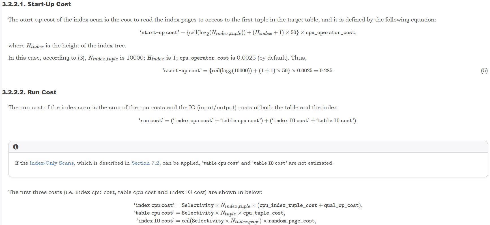

# PostgreSQL为什么有时候用主键查询不走主键索引


## 前言

前段时间遇到一个案例，业务的一条查询SQL中带了很多and组合的过滤条件，其中包含主键，用户的意图是通过主键定位到记录，再用其他条件判断这条记录是否满足要求。按理说这条SQL应该走主键索引，但是实际上却走了另一个效率很低的索引。


## 示例

为了方便说明，下面用一个简单的例子演示一下

准备表和数据

```
create table tb1(id text primary key,c1 text,c2 text, c3 text);
insert into tb1 select id,id%100,id%100,id%100 from generate_series(1,100000)id;
```

执行查询SQL

```
explain analyze select * from tb1 where id='1' and c1='2' and c2='2' and c3='2';
```

执行时间0.030ms，执行计划如下

```
postgres=# explain analyze select * from tb1 where id='1' and c1='2' and c2='2' and c3='2';
                                                   QUERY PLAN
----------------------------------------------------------------------------------------------------------------
 Index Scan using tb1_pkey on tb1  (cost=0.41..8.44 rows=1 width=128) (actual time=0.017..0.018 rows=0 loops=1)
   Index Cond: (id = '1'::text)
   Filter: ((c1 = '2'::text) AND (c2 = '2'::text) AND (c3 = '2'::text))
   Rows Removed by Filter: 1
 Planning Time: 0.074 ms
 Execution Time: 0.030 ms
(6 rows)
```

在c1,c2,c3上创建一个组合索引

```
create index on tb1(c1,c2,c3);
```

再次执行前面的SQL，使用了组合字段索引，执行时间0.917ms，效率大为降低。

```
postgres=# explain analyze select * from tb1 where id='1' and c1='2' and c2='2' and c3='2';
                                                      QUERY PLAN
-----------------------------------------------------------------------------------------------------------------------
 Index Scan using tb1_c1_c2_c3_idx on tb1  (cost=0.42..8.44 rows=1 width=11) (actual time=0.898..0.899 rows=0 loops=1)
   Index Cond: ((c1 = '2'::text) AND (c2 = '2'::text) AND (c3 = '2'::text))
   Filter: (id = '1'::text)
   Rows Removed by Filter: 1000
 Planning Time: 0.312 ms
 Execution Time: 0.917 ms
(6 rows)
```

从这个示例可见，这种情况是很容易发生的。


## 分析

为什么会发生这种情况？PostgreSQL的优化器是基于代价的，哪个执行路径的代价低就选谁，这意味着PostgreSQL认为主键索引的代价不比组合字段索引低。比如表的记录数非常少时，可能会优先使用全表扫描。

这个例子里，我们看到2个执行计划的代价是相同的，都是8.44（PG认为代价相差小于1%的执行计划代价相同），但为什么不选主键索引呢？通过debug发现，PG按建索引的时间从新到旧的顺序评估索引，因此先评估的`tb1_c1_c2_c3_idx`索引，并优先作为最优路径。如果再在主键上建一个相同的索引，那么这个索引会在优化器中胜出（reindex 主键无效）。

```
create index on tb(id);
```

这个示例和实际案例的情况还是有些不太一样。这个例子中两种索引的代价是一样的，但是实际案例中，组合索引的代价比主键索引小了0.2左右。这就和影响索引扫描代价估算的相关因素有关了，比如索引大小，索引高度，索引相关性等等。具体可以参考下面的文章和相关代码（cost_index函数）

http://www.interdb.jp/pg/pgsql03.html




上面的测试环境是PG12,如果是PG13以后版本情况会略有不同。

PG13中，重复的索引项再存储时进行了压缩，因此需要更少的存储空间，并有可能表现出更低的索引高度，而更容易让优化器选中自己。

在PG13中，执行相同的测试，组合索引的代价减小了0.1左右。

```
postgres=# explain analyze select * from tb1 where id='1' and c1='2' and c2='2' and c3='2';
                                                       QUERY PLAN
------------------------------------------------------------------------------------------------------------------------
 Index Scan using tb1_c1_c2_c3_idx on tb1  (cost=0.29..8.32 rows=1 width=128) (actual time=0.919..0.920 rows=0 loops=1)
   Index Cond: ((c1 = '2'::text) AND (c2 = '2'::text) AND (c3 = '2'::text))
   Filter: (id = '1'::text)
   Rows Removed by Filter: 1000
 Planning Time: 0.326 ms
 Execution Time: 0.939 ms
(6 rows)
```

代价减小的原因在于，组合索引的页面减少,索引高度降低了。

```
postgres=# \di+
                                             List of relations
 Schema |       Name       | Type  |  Owner   | Table | Persistence | Access Method |  Size   | Description
--------+------------------+-------+----------+-------+-------------+---------------+---------+-------------
 public | tb1_c1_c2_c3_idx | index | postgres | tb1   | permanent   | btree         | 728 kB  |
 public | tb1_pkey         | index | postgres | tb1   | permanent   | btree         | 3816 kB |
(2 rows)
postgres=# select * from bt_metap('tb1_pkey');
 magic  | version | root | level | fastroot | fastlevel | oldest_xact | last_cleanup_num_tuples | allequalimage
--------+---------+------+-------+----------+-----------+-------------+-------------------------+---------------
 340322 |       4 |  412 |     2 |      412 |         2 |           0 |                  100000 | t
(1 row)

postgres=# select * from bt_metap('tb1_c1_c2_c3_idx');
 magic  | version | root | level | fastroot | fastlevel | oldest_xact | last_cleanup_num_tuples | allequalimage
--------+---------+------+-------+----------+-----------+-------------+-------------------------+---------------
 340322 |       4 |    3 |     1 |        3 |         1 |           0 |                  100000 | t
(1 row)
```


索引高度降低,相应的执行计划代码也会降低

src/backend/utils/adt/selfuncs.c:

```
            descentCost = (index->tree_height + 1) * 50.0 * cpu_operator_cost;
```


## 解决方案

方法1：改写SQL

通过物化CTE强制先走主键索引

```
with t as MATERIALIZED(
  select * from tb1 where id='1'
)
select * from t where c1='2' and c2='2' and c3='2';
```


方法2：创建扩展统计

本案例中PG选中效率低下的组合索引，原因还是对多个字段组合条件的行估算有误。因此可以通过创建扩展统计改善行估算达到优化的目的。

 ```
 create statistics stat_tb1_c1_c2_c3 on c1,c2,c3 from tb1;
 analyze tb1;
 ```


