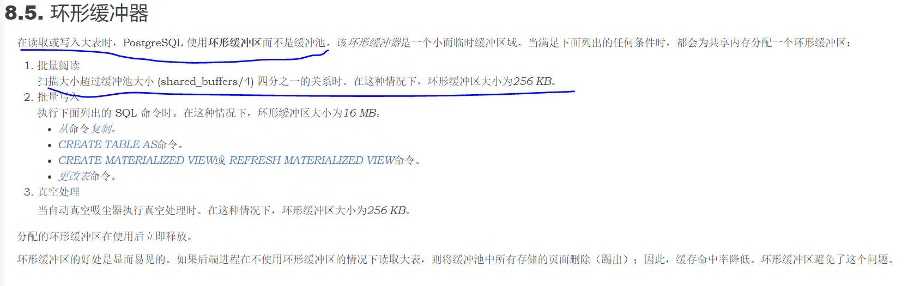

# PostgreSQL全表扫描大表会不会把已经加载到共享缓存的页面全部驱逐


## 背景

有同事问我，PostgreSQL全表扫描大表会不会把已经加载到共享缓存的页面全部驱逐，影响其他SQL的性能。我想PostgreSQL作为一个成熟稳重的开源数据库，断不至于连这点小事都处理不好。但是，咱说话得讲证据，不能信口开河，于是做了个简单的调查。


## PG缓存池的处理逻辑

参考《The Internals of PostgreSQL》，PG在扫描大小超过`shared_buffers`的1/4的表时，使用特殊的环形缓冲区，大小只有256KB。

http://www.interdb.jp/pg/pgsql08.html




## 相关代码

1. initscan时判断表大小是否超过`shared_buffers`的1/4，超过设置`BAS_BULKREAD`策略

src/backend/access/heap/heapam.c:

```
static void
initscan(HeapScanDesc scan, ScanKey key, bool keep_startblock)
{
...
	if (!RelationUsesLocalBuffers(scan->rs_base.rs_rd) &&
		scan->rs_nblocks > NBuffers / 4)  -- 判断表大小是否超过shared_buffers的1/4
	{
		allow_strat = (scan->rs_base.rs_flags & SO_ALLOW_STRAT) != 0;
		allow_sync = (scan->rs_base.rs_flags & SO_ALLOW_SYNC) != 0;
	}
	else
		allow_strat = allow_sync = false;

	if (allow_strat)
	{
		/* During a rescan, keep the previous strategy object. */
		if (scan->rs_strategy == NULL)
			scan->rs_strategy = GetAccessStrategy(BAS_BULKREAD); -- 设置BAS_BULKREAD策略
	}
	else
	{
		if (scan->rs_strategy != NULL)
			FreeAccessStrategy(scan->rs_strategy);
		scan->rs_strategy = NULL;
	}
...
```


2. `BAS_BULKREAD`策略设置环形缓冲区的大小为256KB

src/backend/storage/buffer/freelist.c:

```
BufferAccessStrategy
GetAccessStrategy(BufferAccessStrategyType btype)
{
	BufferAccessStrategy strategy;
	int			ring_size;

	/*
	 * Select ring size to use.  See buffer/README for rationales.
	 *
	 * Note: if you change the ring size for BAS_BULKREAD, see also
	 * SYNC_SCAN_REPORT_INTERVAL in access/heap/syncscan.c.
	 */
	switch (btype)
	{
		case BAS_NORMAL:
			/* if someone asks for NORMAL, just give 'em a "default" object */
			return NULL;

		case BAS_BULKREAD:
			ring_size = 256 * 1024 / BLCKSZ;
			break;
		case BAS_BULKWRITE:
			ring_size = 16 * 1024 * 1024 / BLCKSZ;
			break;
		case BAS_VACUUM:
			ring_size = 256 * 1024 / BLCKSZ;
			break;
...
	}
```


3. 读取BUFERR的时候，如果需要申请新的Buffer，优先选择其环形缓冲区中的下一个成员复用，如果这个成员不是有效BUFFER,则分配新的BUFFER并加入到环形缓冲区。

```
heapgetpage()
  ->ReadBufferExtended()
    ->ReadBuffer_common()
      ->BufferAlloc()
        ->GetBufferFromRing()
```

src/backend/storage/buffer/freelist.c:

```
static BufferDesc *
GetBufferFromRing(BufferAccessStrategy strategy, uint32 *buf_state)
{
	BufferDesc *buf;
	Buffer		bufnum;
	uint32		local_buf_state;	/* to avoid repeated (de-)referencing */


	/* Advance to next ring slot */
	if (++strategy->current >= strategy->ring_size)
		strategy->current = 0;

	/*
	 * If the slot hasn't been filled yet, tell the caller to allocate a new
	 * buffer with the normal allocation strategy.  He will then fill this
	 * slot by calling AddBufferToRing with the new buffer.
	 */
	bufnum = strategy->buffers[strategy->current];
...
```


## 测试验证

做一个简单的测试

设置`shared_buffers`为4MB

```
alter system set shared_buffers = '4MB';
```

准备数据

```
 create extension pg_buffercache;
 create table tb1(id int,c1 text);
 create table tb2(id int,c1 text);
 insert into tb1 select id,id::text from generate_series(1,1000000)id;
 insert into tb2 select id,id::text from generate_series(1,10000)id;
```

查看表大小

```
postgres=# \d+
                                        List of relations
 Schema |      Name      | Type  |  Owner   | Persistence | Access Method |  Size   | Description
--------+----------------+-------+----------+-------------+---------------+---------+-------------
 public | pg_buffercache | view  | postgres | permanent   |               | 0 bytes |
 public | tb1            | table | postgres | permanent   | heap          | 42 MB   |
 public | tb2            | table | postgres | permanent   | heap          | 472 kB  |
(3 rows)

postgres=# select relname,relpages from pg_class where relname in ('tb1','tb2');
 relname | relpages
---------+----------
 tb1     |     5405
 tb2     |       54
(2 rows)
```

重启PG，确保tb1和tb2未加载到缓冲区

```
postgres=# select relfilenode::oid::regclass,count(*),avg(usagecount)::numeric(10,1) from pg_buffercache where relfilenode> 10000 group by relfilenode;
 relfilenode | count | avg
-------------+-------+-----
(0 rows)
```

读入tb2，tb2的大小不足`shared_buffers`的1/4,可以看到tb2的所有页面都进入了缓冲区。

```
postgres=# select count(*) from tb2;
 count
-------
 10000
(1 row)

postgres=# select relfilenode::oid::regclass,count(*),avg(usagecount)::numeric(10,1) from pg_buffercache where relfilenode> 10000 group by relfilenode;
 relfilenode | count | avg
-------------+-------+-----
 tb2         |    54 | 1.0
(1 row)
```

读入tb1，tb1的大小超过了`shared_buffers`的1/4,可以看到tb1只有很少一部分页面都进入了缓冲区。不过大小也不是256KB，是768KB。

```
postgres=# select count(*) from tb1;
  count
---------
 1000000
(1 row)

postgres=# select relfilenode::oid::regclass,count(*),avg(usagecount)::numeric(10,1) from pg_buffercache where relfilenode> 10000 group by relfilenode;
 relfilenode | count | avg
-------------+-------+-----
 tb1         |    96 | 1.0
 tb2         |    54 | 1.0
(2 rows)
```


